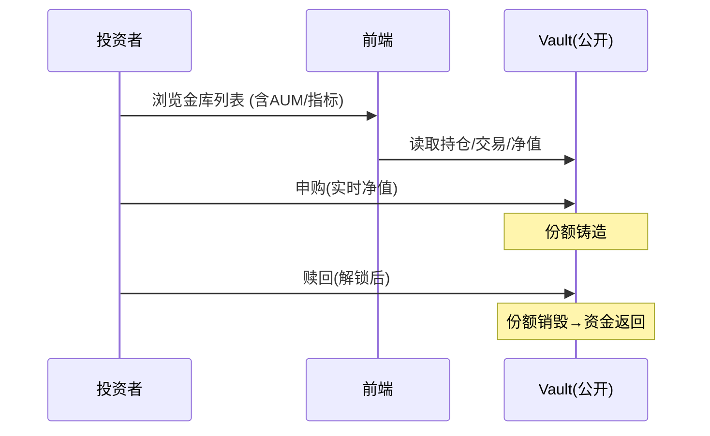
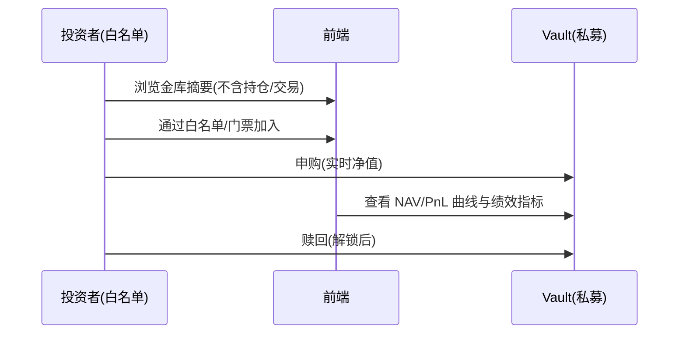

# VaultCraft v0

可验证的人类交易员金库平台（Public 透明 + Private 不公开持仓）。本仓库包含：
- 合约（Solidity）：最小金库 `Vault`（ERC20 份额、最短锁定、HWM 绩效费、Public/Private、适配器白名单、可暂停）
- 测试：Foundry（Solidity 高覆盖）与 Hardhat（JS/TS 生态）
- 后端（Python/uv）：指标计算与最小 API（年化、波动、Sharpe、最大回撤、恢复期）
- 文档：PRD 与技术方案（docs/）

演示链：任选运行良好的 EVM 测试网（建议 Base Sepolia 或 Arbitrum Sepolia）。

---

## 架构总览

```mermaid
flowchart LR
  subgraph Dapp
    Web[前端/SDK]
  end

  subgraph Chain[EVM L2 Testnet]
    V[Vault 4626 简化]
    A1[Adapter: Spot DEX]
    A2[Adapter: Perps (占位)]
    V -- execute(adapter,data) --> A1
    V -- execute(adapter,data) --> A2
  end

  subgraph Backend[Backend (FastAPI)]
    IDX[事件索引/快照]
    MET[指标计算]
    API[只读 API]
  end

  Web <--> API
  Web --> V
  IDX --> MET --> API
```

---

## 用户交互流程

Public（公募，持仓透明）


Private（私募，不公开持仓）


---

## 路线与取舍

- v0 只实现必要特性：最短锁定、HWM 绩效费、公募透明、私募不公开持仓、白名单资产与适配器、可暂停。
- 计划中：
  - [ ] 锁定周期费率曲线
  - [ ] Reduce-Only 模式
  - [ ] 容量/拥挤/风险函数
  - [ ] 批量窗口（Batching Window）
  - [ ] 私有路由与 AA（Gasless）
  - [ ] 期权与 RWA 适配器
  - [ ] Manager 质押与削减（Manager Staking & Slashing）
  - [ ] Manager 持仓上限曲线

---

## 快速开始（Backend）

推荐配置：Python 3.10+ & uv

```
cd apps/backend
uv venv
uv pip install -q pytest pytest-cov
uv run pytest -q
uv run uvicorn app.main:app --reload
```

如遇 `pytest` 未找到，请先执行 `uv pip install -q pytest` 再 `uv run pytest -q`。

---

## 快速开始（Hardhat）

要求：Node 18+（已内置）

```
cd hardhat
npm install
npx hardhat compile
npx hardhat test
```

部署到测试网（示例）
```
# 设置环境变量（示例，请替换）
$env:RPC_URL="https://sepolia.base.org"
$env:PRIVATE_KEY="0x..."  # 部署私钥，务必小额测试

# 创建简单部署脚本（scripts/deploy.ts），或使用 hardhat task
# 示例 task（伪代码）：
# const Vault = await ethers.getContractFactory("Vault")
# const vault = await Vault.deploy(asset, name, symbol, admin, manager, guardian, isPrivate, pBps, lockDays)
```

说明：Hardhat 项仅用于 JS/TS 生态的编译与最小测试；Solidity 侧高覆盖测试仍由 Foundry 提供（见下）。

---

## 快速开始（Web 前端）

```
cd apps/web
npm install
npm run dev
# 打开 http://localhost:3000 查看示例列表与详情
```

当前为静态演示数据。待测试网部署完成后，可接入真实合约地址与后端 API（指标/NAV）。

---

## 快速开始（Foundry，可选）

Foundry 优点：
- Solidity 原生测试（速度快、覆盖率高、不变量/模糊更便利）
- 适合合约会计、事件与边界条件的细粒度测试

安装 Foundry（建议 WSL 或参照官方文档），然后：
```
cd contracts
forge build
forge test -vvv
# 覆盖率
forge coverage --report lcov
```

---

## 测试覆盖要点

Solidity（Foundry）：
- 申购/赎回保持单位净值 PS 不变
- HWM 绩效费（铸份额）仅在 PS > HWM 时计提
- 私募白名单门控（非白名单拒绝）
- 最短锁定生效（解锁前赎回失败）
- 暂停/恢复阻断交互
- 仅经理可执行适配器；适配器需白名单
- 第三方赎回（allowance）
- 管理员参数变更与上限
- 快照事件与白名单事件发射

后端（pytest）：
- 指标计算：年化/波动/Sharpe/最大回撤与恢复期

---

## 项目结构

```
contracts/               # Solidity 源码与 Foundry 测试
  Vault.sol
  test/
    Vault.t.sol
    mocks/
    utils/

hardhat/                 # Hardhat 项（JS/TS 生态）
  contracts/             # 复制的最小合约以便编译
  test/

apps/backend/            # FastAPI + 指标
  app/
  tests/

docs/                    # PRD 与技术方案
```

---

## 研发流程（TDD）

- 优先在 Foundry 编写/运行合约单测与性质测试；
- 若需 JS/TS 生态/前端联调，使用 Hardhat（不替代 Foundry 测试）；
- 后端以 pytest 驱动指标/索引逻辑；
- 功能合入前要求：测试通过 + 关键不变量/事件覆盖。

---

## 适配 Perps（占位）

- v0 合约已提供 `execute(adapter,data)` 与适配器白名单；
- 首选接 Synthetix Perps，后续可扩 Hyper/GMX/Vertex/Aevo；
- 测试网准备：RPC、测试代币、perps 市场/保证金资产；
- 若短期无可用市场，先以 MockAdapter 演示调用链路。

---

## 迁移 HyperEVM（预留）

- Router/Adapter 解耦；
- 事件/快照格式稳定，便于在新链重放对账；
- Private 视图门控与签名门票逻辑与链无关，可复用。

---

## 参考文档

- 产品文档：docs/PRD.md（v0 范围、参数与治理矩阵、Backlog）
- 技术方案：docs/TECH_DESIGN.md（架构、接口、事件、不变量、TDD 计划）
