# VaultCraft 


> 面向下一个未开发的蓝海


---

  
## 优势


- **双形态金库**：公募金库保持 HyperLiquid 式透明；私募金库只向白名单披露 NAV/PnL，未来采用零知识证明+账户抽象化实现隐私交易。

- **受控执行通道**：链上 Router/Adapter + 后端 Exec Service 双重限权，限制标的、杠杆、名义金额，支持 reduce-only、自动电话告警，并可在 Hyper Perps ↔ Mock Gold（XAU）之间切换。

- **All in One 快速部署**：钱包连接、状态栏、NAV 曲线、事件流、经理控制台与投资者 Portfolio 集成于单一应用。

- **可观测性内建**：NAV 快照、事件日志、Webhook 告警（回撤 / 执行失败）、status API、CLI 辅助排查。

- **TDD 基线**：Hardhat + Foundry 覆盖合约逻辑（85%+），FastAPI pytest（40+），前端构建校验。

  

---

  

## ✨ 功能矩阵（已实现范围）

  

| 能力 | 公募金库 | 私募金库 | 说明 |

| --- | --- | --- | --- |

| 链上份额会计 | ✅ | ✅ | ERC4626 share、最短锁定、HWM 绩效费、适配器白名单、可暂停 |

| 信息披露 | 持仓/事件全公开 | NAV/PnL 与 KPI 公示，持仓隐藏 | 私募需要链上 whitelist；邀请码演示走前端 |

| 执行通道 | Hyper SDK（dry-run ↔ live），失败可 reduce-only；Mock Gold/XAU demo 走 `mock_gold` venue | 同 | `ENABLE_LIVE_EXEC` 统一开关，`venue` 参数控制具体适配器 |

| 风控 | 交易对白名单、杠杆上/下限、名义金额区间、告警黄条；Manager 设置页可编辑 per-vault Risk Template | 同 | `/status` 实时返回参数 |

| 告警 | 回撤 / 执行失败 → Webhook（电话/短信） | 同 | 冷却策略可配 |

| Listener | WS listener fan-out，事件 `source:"ws"` | 同 | Testnet 偶有无实时 fill，ack 兜底 |

  

---

  

## 🧩 系统架构

```mermaid
flowchart LR

  subgraph Frontend[Next.js 前端]
    FE[Discover / Vault / Portfolio / Manager]
  end

  subgraph Backend[FastAPI & Exec Service]
    API[/"REST API\n/status · /nav_series · /events · /metrics\n/pretrade · /exec/*"/]
    PRICE["行情路由\nHyper SDK → REST → 演示价"]
    EXEC["Exec Service\n风控 + SDK driver + Positions store"]
    LISTENER["User WS Listener\n(ack/ws fan-out)"]
    SNAP[Snapshot Daemon]
    ALERT[Alert Manager]
  end

  subgraph Chain["EVM (Hyper Testnet)"]
    VAULT[Vault 4626]
    ROUTER[Router]
    ADAPTER[Perps Adapter]
  end

  subgraph HyperSDK[Hyperliquid API]
    SDK[Python SDK]
    REST[("(REST)")]
    WS((User Events WS))
  end

  FE <-->|https://…/api/v1| API
  EXEC --> VAULT
  EXEC --> SDK
  LISTENER ---> WS
  PRICE --> REST
  ALERT -->|Webhook| Phone
```

  



  

---

  

## 📋 实现进度


| 阶段 | 状态 | 说明 |

| --- | --- | --- |

| **P0 链上闭环** | ✅ | 份额申赎 / HWM 绩效费 / 私募白名单 / Manager 控制台 / NAV 曲线 |

| **P1 体验打磨** | ✅ | Manager 标签页 + 高级设置折叠、状态条、Drawdown 告警、Webhook |

| **P2 Hyper 实单** | ✅ | Hyper SDK dry-run 与小额实单、reduce-only Fallback、风险参数 UI |

| **P3 落地打磨** | ✅ | Listener `source:"ws"` 适配测试网实时 fill；Skeleton 细节

  

> 完整进度详见 [Commits · Wenbobobo/VaultCraft](https://github.com/Wenbobobo/VaultCraft/commits/master/))  及文档  （ `docs/product/PLAN_V1.md`， `docs/ops/PROGRESS.md`）。


---

  

## ⚙️ 统一环境变量配置说明（ `.env`）


> 仓库仅认可根目录 `.env`，前后端/Hardhat 共用。示例见 `.env.example`；若部署到长驻环境，请先复制 `.env.staging.example` 或 `.env.production.example` 到 `.env` 并按需覆写密钥。


| 分类 | 关键变量 | 说明 |

| --- | --- | --- |

| 执行与行情 | `HYPER_API_URL` / `HYPER_RPC_URL` / `ENABLE_HYPER_SDK` / `ENABLE_LIVE_EXEC` / `HYPER_TRADER_PRIVATE_KEY` (或 `PRIVATE_KEY`) / `EXEC_ALLOWED_SYMBOLS` / `EXEC_ALLOWED_VENUES` / `EXEC_MIN/MAX_LEVERAGE` / `EXEC_MIN/MAX_NOTIONAL_USD` / `EXEC_MARKET_SLIPPAGE_BPS` / `EXEC_RO_SLIPPAGE_BPS` / `EXEC_RETRY_*` / `APPLY_*_TO_POSITIONS` | Hyper 测试网最小下单约 $10，建议 `EXEC_MIN_NOTIONAL_USD=10`；`EXEC_ALLOWED_VENUES` 控制可用适配器（如 `hyper,mock_gold`） |

| Listener & Snapshot | `ENABLE_USER_WS_LISTENER` / `ADDRESS` / `ENABLE_SNAPSHOT_DAEMON` / `SNAPSHOT_INTERVAL_SEC` | Listener 需开启 live exec 且使用有余额私钥 |

| 告警 | `ALERT_WEBHOOK_URL` / `ALERT_COOLDOWN_SEC` / `ALERT_NAV_DRAWDOWN_PCT` | 可直接使用 fwalert 链路 |

| 部署写接口 | `DEPLOYMENT_API_TOKEN` | 若配置，`/api/v1/exec/*`、`/api/v1/nav/snapshot/*`、`/api/v1/positions/*`、`/api/v1/register_deployment` 均要求 `X-Deployment-Key`；建议仅由后端脚本/CI 调用，前端演示需显式传入 |
| Quant API | `QUANT_API_KEYS` / `ENABLE_QUANT_ORDERS` | 逗号分隔 API Key 白名单；启用后 `/api/v1/quant/*` 需附带 `X-Quant-Key`。可用 `uv run python -m app.cli quant-keys --list/--add/--remove` 统一增删；将 `ENABLE_QUANT_ORDERS=1` 打开量化下单端点。 |
| 日志 | `LOG_LEVEL` / `LOG_FORMAT` / `LOG_PATH` | `LOG_FORMAT=json` 输出结构化 JSON；`LOG_PATH` 留空时写 stdout，指定路径会自动创建目录并写入文件 |

| 前端 | `NEXT_PUBLIC_BACKEND_URL` / `NEXT_PUBLIC_RPC_URL` / `NEXT_PUBLIC_DEFAULT_ASSET_ADDRESS` / `NEXT_PUBLIC_ENABLE_DEMO_TRADING` | 默认显示钱包按钮；填入 Hyper USDC 可跳过 MockERC20 流程 |

| 持久化 | `POSITIONS_FILE` / `EVENT_LOG_FILE` | 默认 `deployments/positions.json` / `logs/events.jsonl` |

  
---

  

## 🚀 部署详细步骤

  

> 前置依赖：Node 18+、pnpm 8+、Python 3.11+、[uv](https://github.com/astral-sh/uv)、Hardhat 工具链、已充值的 Hyper Testnet 钱包（gas + USDC）。

  
1. 安装依赖  

   ```powershell

   pnpm install --recursive

   cd apps/backend

   uv venv

   uv sync

   ```

2. 启动后端  

   ```powershell

    cd apps/backend

    uv run pytest -q

    uv run uvicorn app.main:app --reload --port 8000

   ```

3. 启动前端  

   ```powershell

   cd apps/vaultcraft-frontend

   pnpm dev   # http://localhost:3000

   ```

4. 合约校验  

   ```powershell

   cd hardhat

   npm install

   npx hardhat test

   # 可选：npm run deploy:hyperTestnet

   ```

5. CLI 辅助（可选）  

   ```powershell

   cd apps/backend

   uv run python -m app.cli exec-open <vault> ETH 0.01 buy --leverage 2

   uv run python -m app.cli exec-close <vault> ETH --size 0.01

   ```

  

---

  

## 🧭 快速上手

  
1. **连接钱包**：右上角按钮一键添加/切换至 Hyper Testnet（chainId 998），状态栏显示网络信息。  

2. **Manager Launch Checklist**：在 `/manager` 页面检查资产元数据、经理余额、风险参数。  

3. **部署金库**：填入 Hyper USDC、名称、代号，点击部署；成功后自动登记到 Listener。  

4. **金库管理**：下拉选择最新部署的金库，可调整白名单、锁期、绩效费、Guardian 等高级设置。  

5. **交易面板**：切换“交易面板”Tab，选择市场后 TradingView 图表与订单票据会同步；支持 Market/Limit、GTC/IOC/FOK、Reduce-only、止盈/止损与最小名义提示。  

6. **投资者视角**：在 `/browse` 发现金库，`/vault/{id}` 查看 KPI / NAV / Events / Holdings，`/portfolio` 查看份额、锁定期与简易 PnL。  

7. **Shock 与告警**：点击 “Simulate -10% Shock” 模拟 NAV 下挫，引发黄色告警条与 webhook 电话。  

8. **Listener 状态**：状态栏显示 Listener/Snapshot 状态；事件流中 `source: ack | ws` 徽章区分来源（测试网若暂无实时 fill，请提示评委 ack 已兜底）。  

---

## 🧪 测试与质量保障


| 层级 | 命令 | 覆盖重点 |

| --- | --- | --- |

| 合约（Hardhat） | `npx hardhat test` | 6 条用例覆盖申赎、绩效费、白名单、暂停、适配器、shares |

| 合约（Foundry，可选） | `forge test -vvv` | 不变量/模糊测试（见 `contracts/test/`） |

| 后端 | `uv run pytest -q` | 44 条：指标、风控、重试、快照、listener、告警、CLI |
| 后端 soak 监控 | `uv run python -m app.cli soak --duration 600 --interval 30` | 长时间健康检查，生成 `logs/soak-report.jsonl` 供 Alpha 稳定性复核 |

| 前端 | `pnpm run build` | 确保 Next.js 打包通过，`pnpm run lint` 可做增量校验 |

> 需要一次性运行全部测试可执行：`uv run python scripts/run_ci.py`（支持 `--only backend`、`--skip frontend` 等筛选）。

  

开发规范：新增功能需同步单测，更新相关文档与 demo 脚本；提交前必须本地跑通上述命令。

  

---

  

## 🔔 告警与可观测性

  

- `ALERT_NAV_DRAWDOWN_PCT` + `ALERT_COOLDOWN_SEC` 避免重复呼叫。  

- `EVENT_LOG_FILE` 追加 NDJSON，便于审计与截图。  

- `/api/v1/status` 暴露执行模式、listener/snapshot 状态、最近一次 WS 时间戳。  

- `/api/v1/events/:vault?types=exec_open,fill` 用于前端事件流，支持 filters + auto scroll。  

  

---

  

## 📚 文档索引

  

| 场景 | 文件 |

| --- | --- |

| 产品 / 评委 | `docs/product/PRD.md`, `docs/product/PLAN_V1.md` |

| 架构 / 开发 | `docs/architecture/ARCHITECTURE.md`, `docs/architecture/TECH_DESIGN.md`, `docs/architecture/FRONTEND_SPEC.md`, `docs/architecture/HYPER_INTEGRATION.md` |

| 运营 / 部署 | `docs/ops/DEPLOYMENT.md`, `docs/ops/HYPER_DEPLOYMENT.md`, `docs/ops/CONFIG.md`, `docs/ops/DEMO_PLAN.md`, `docs/ops/PROGRESS.md`, `docs/ops/ISSUES.md`, `docs/ops/PITCH_DECK.md` |

| 调研 / 历史 | `docs/research/PERPS_RESEARCH.md`, `docs/research/Perps 适配器及交易品种调研报告.pdf`, `docs/archive/*` |


## 📡 Quant API（Beta）

- 在 `.env` 配置 `QUANT_API_KEYS=alpha,beta` 后，客户端需在 Header 附带 `X-Quant-Key`。
- `GET /api/v1/quant/positions?vault=0x...`：返回指定 Vault 的现金、仓位、份额。
- `GET /api/v1/quant/prices?symbols=BTC,ETH`：提供行情数据，口径与风控一致。
- `GET /api/v1/quant/markets`：暴露可交易对及杠杆上限，便于量化终端同步。
- `WS /ws/quant?vault=0x...&interval=5`：WebSocket 推送 status/risk/positions/价格快照，并在 `events` 字段附带最新 exec/fill 事件，`deltas.positions` 表示仓位增量。Header 同样需附带 `X-Quant-Key`。CLI 示例：`uv run python -m app.cli quant-ws --vault 0x... --interval 5 --duration 300 --key alpha --outfile logs/quant-stream.jsonl`。
- `POST /api/v1/quant/orders/open` & `/close`：量化端直接调用 Exec Service（默认 dry-run，设置 `ENABLE_LIVE_EXEC=1` 后可落地实单）。需 `ENABLE_QUANT_ORDERS=1`。可用 CLI `uv run python -m app.cli quant-order --backend http://127.0.0.1:8000 --key alpha --symbol ETH --size 1 --side buy --vault 0x...` 快速提交。
- 多市场：订单/Pretrade/Exec 均新增 `venue` 字段（默认 `hyper`，可选 `mock_gold` 用于 XAU Demo），配合 `EXEC_ALLOWED_VENUES`/`allowedVenues` 风控模板，前端/CLI 可以自由切换；长期路线见 `docs/architecture/MULTI_MARKET_ADAPTER.md`。
- 多市场接入的整体蓝图与步骤详见 `docs/architecture/MULTI_MARKET_ADAPTER.md`。

## ⚠️ Risk Template Override

- `GET /api/v1/vaults/{vault}/risk`：返回平台默认模板（base）、当前 per-vault override 与生效值（effective）。
- `PUT /api/v1/vaults/{vault}/risk`：提交覆写字段（允许标的、杠杆区间、名义额度），空体代表恢复默认；已写回 `deployments/hyper-testnet.json`。
- Manager 设置页的 “Risk Template Override” 表单已对接该接口，可视化编辑 + 一键重置，配合 `/status` 与 Exec Panel 风控提示保持一致。

---

## 🗺 Roadmap 概览

  

- **v1 打磨（P3）**  

  -  Hyper Testnet 实时 fill，捕获 `source:"ws"` 事件并更新 demo 资料。  

  - 全量测试 & Skeleton/空态补充。  

  - 对齐 README / DECK / DEMO_PLAN。  

  

- **v2 方向**  

  - 手续费率曲线（默认无锁期，按持有时长收费）。  

  - 多市场适配器：Polymarket、美股、贵金属、期权。  

  - WhisperFi 集成：私募交易隐私、对账证明。  

  - Vault Composer：金库组合/策略拼装。  

  - 指标与多语言 UX（含中文界面、Merke 承诺等）。  

---
Deck Link： https://docs.google.com/presentation/d/1ixpVbJKtfyjMvcd6Y22YcJ9uXmkcUmyZ/edit?usp=sharing&ouid=115326369798975944335&rtpof=true&sd=true
Demo Video：https://drive.google.com/file/d/1z0Bz9aGaUAVyB_9obrh0x3E3Qzj19LLm/view?usp=sharing
