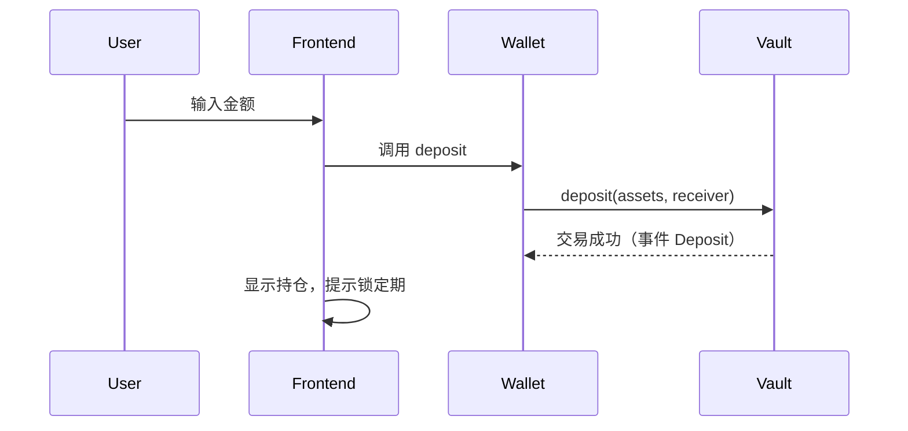
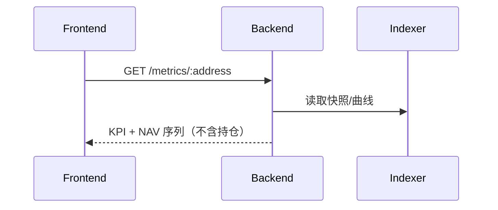

# VaultCraft 架构解析（v0 → v1)

本文件阐述前端/后端/链上职责、技术栈、数据流，并提供 Mermaid 图示，帮助团队对齐边界与扩展方向。

---

## 1. 总图（System Overview）

```mermaid
flowchart LR
  subgraph Frontend[Frontend]
    UI[Next.js/Tailwind UI]
    WAL[Wallet (wagmi/viem)]
  end

  subgraph Backend[Backend Services]
    API[FastAPI (REST/WS)]
    IDX[Indexer: Chain Events]
    MET[Metrics Engine]
    ING[Order Ingestor]
    BUS[Execution Bus]
    ALL[Fill Allocator]
    REC[Reconciler]
  end

  subgraph OnChain[EVM Chain]
    V[Vault (ERC4626-lite)]
    AD[Adapters (Spot/Perps stubs)]
  end

  UI <--> WAL
  UI --> API
  WAL <--> V
  API <--> IDX
  API <--> MET
  API <--> ING
  ING --> BUS --> ALL --> REC
  API <--> REC
  V --> AD
```

- Frontend：呈现与交互（读链 + 调后端）。钱包签名仅用于链上申赎与登录（可选）。
- Backend：
  - Indexer：订阅链上事件，聚合 NAV 快照与参数变更
  - Metrics：计算年化/波动/Sharpe/回撤/恢复期
  - Ingestor：接前端/经理订单，写入 orders
  - Execution Bus：按市场/方向聚合为平台级净订单，对接外部场所（Hyper）
  - Allocator：按各 Vault 未成交比例分摊成交，写入 allocations
  - Reconciler：定期对账（Σallocations vs 外部账户权益），异常触发 reduce-only 与告警
- On‑chain：Vault 份额、最短锁定、HWM 绩效费、白名单适配器；不负责跨链桥接或复杂风控（v0）

---

## 2. 功能归属（v0）

- 前端（Next.js + Tailwind）
  - 发现/详情/我的/申赎 UI
  - 读链（ps、totalAssets、isPrivate、lockMinSeconds、performanceFeeP）
  - 调后端获取指标与事件（可选）
- 后端（FastAPI）
  - 指标计算（/metrics），事件（/events），静态金库元数据（/vaults）
  - v1：Exec Service 调 Hyperliquid + 对账与承诺
- 链上（Solidity）
  - 申赎/锁定/HWM 绩效费/白名单适配器/可暂停
  - 事件：Deposit/Withdraw/PerformanceFeeMinted/NavSnapshot/ParamChange

---

## 3. Hyper Testnet 集成（建议）

- 采用 Hyper Testnet 作为 perps 执行与行情来源；前端功能与后端职责不变
- 执行路径（v1）：
  1) Manager/Service 在 Exec Service 中以限权身份（API key/签名凭证）下单
  2) Exec Service 记录订单 → 成交回报（WS/REST）
  3) Indexer/Exec 将成交对账写入承诺日志（链上/链下）
  4) NAV 依行情 + 持仓权益计算，展示到前端（私募仅 NAV/PnL）
- 资产托管：不迁移资金；资金仍在 Vault。Demo 以“合成 NAV”展示（评审可接受的路线图方案）

---

## 4. 跨链与特殊资产（规划）

- 目标资产：现货黄金（PAXG/XAUT/合成 XAU）、美股、期权
- 方案（阶段化）：
  - v1：只读接入与会计展示（不迁移资金），以“合成头寸”展示风险与 NAV
  - v2：跨链桥接 Or Messaging（”集中金库、分布执行“），统一结算（延迟）
  - 安全边界：桥接与清算隔离、只读与实资金隔离
- 架构：
  - Cross‑Chain Indexer（多链事件/NAV 汇总）
  - Bridge Orchestrator（可替换桥）
  - Adapter per chain（读写分离）

---

## 5. 数据流（典型）

### 5.1 申购


### 5.2 NAV 展示（私募）


---

## 6. 技术栈与特色

- 前端：Next.js 14 + Tailwind，组件化设计系统，Mermaid 文档演示
- 后端：FastAPI + uv 环境 + SQLAlchemy/SQLite，易于迁移到 Postgres
- 链上：Solidity 0.8.23，Foundry/Hardhat 双栈；ERC20 份额 + 最小 4626 风格
- DevEx：PowerShell + uv + Hardhat 任务 + 高覆盖测试

---

## 7. 路线图（里程碑）

- v0：Public/Private、申赎/锁定、HWM 费率、最小后端指标、发现/详情/我的
- v1：Hyper Testnet Exec、私募合成 NAV、批量窗口与队列 UI、容量可视化、告警
- v2：多资产多链（期权/黄金/美股）、桥接/消息、DAO/时间锁与参数治理
